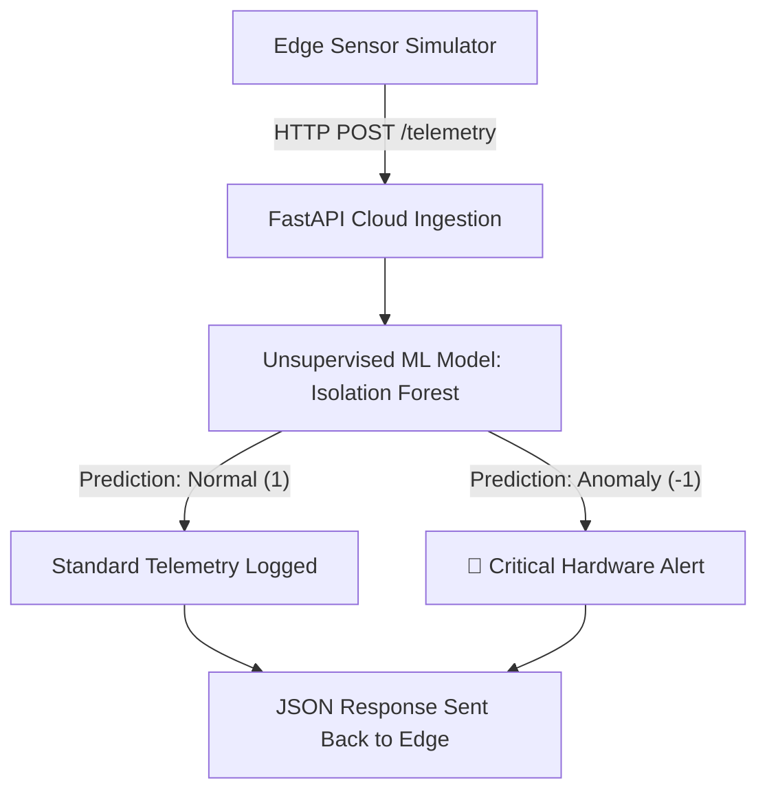

 # Real-Time Edge-to-Cloud Predictive Anomaly Detection Pipeline 

A distributed edge-to-cloud telemetry ingestion and predictive anomaly detection pipeline designed for industrial IoT, smart infrastructure, and energy applications. It simulates high-frequency edge sensor telemetry and leverages an unsupervised machine learning model on the cloud backend to flag hardware anomalies instantly.

---

##  System Architecture & Workflow

Edge Telemetry Simulator: Continuously streams real-time sensor metrics (temperature, pressure, vibration) and dynamically injects structural anomalies.

Cloud Processing Engine: Built with FastAPI to ingest asynchronous high-frequency requests safely.

Machine Learning Anomaly Detection: Utilizes scikit-learn's IsolationForest to analyze multi-dimensional feature spaces and isolate anomalies.

##  Technical Stack
API Framework: FastAPI & Uvicorn for asynchronous telemetry ingestion.

Machine Learning: Scikit-Learn (IsolationForest) for unsupervised anomaly detection.

Data Processing & Validation: Pandas, NumPy, and Pydantic for high-performance numerical operations and strict payload validation.

Networking: HTTPX for asynchronous edge-to-cloud communication.
